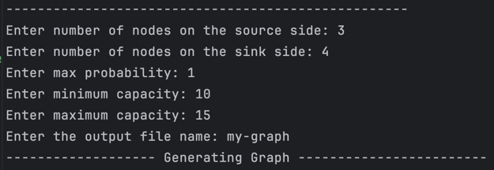

# maximum-flow-algorithm

## Preflow-Push Algorithm
- Execution
```bash
 python3 preflow_push_maximum_flow.py ${input-graph-filepath}
 
 # example
 python3  preflow_push_maximum_flow.py GraphGenerator/FixedDegree/100v-5out-25min-200max.txt
```

## GraphGenerator & TestCase
### Generate TestCase
- The graph generators is in GraphGenerator directory, and there are four graphs, `Bipartite`, `FixedDegree`, `Mesh` and `Random`.
- The result is store in the related graph directory.
- How to execute:
```
cd GraphGenerator 
java ${graphGenerator} # BipartiteGraph, FixedDegreeGraph, MeshGenerator, RandomGraph

# example
cd GraphGenerator 
java BipartiteGraph
```
- Execution example:
- The result is in `/GraphGenerator/Bipatite`


### Testcase Format
- Format: (node1, node2, capacity)
- Example:
```
s v1 10
s v2 5
s v3 7
v1 v6 8
v2 v4 5
v2 v6 9
v2 v9 7
v4 v2 5
v4 v5 8
v5 v4 8
v6 v1 8
v6 v2 9
v2 t 7
```

## TestcaseInClass
The testcases on the canvas.